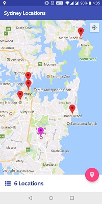
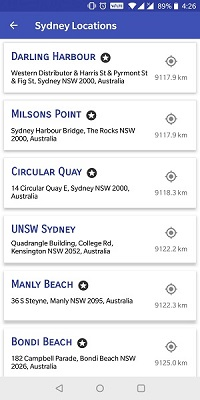
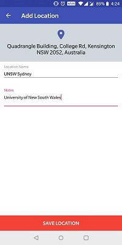
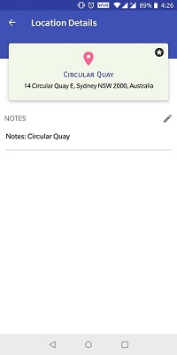

# LocationsApp
An android pp to show locations of common places in Sydney. Users can view default locations and add custom locations as well. All the locations are persisted locally.

## Screenshots

         

## Assumptions

* Default locations are imported from the JSON files on first launch of the app and stored locally.
* The marker is placed on the user's current location when the user clicks on add location feature. If the current location is not known, the marker is placed in Sydney.
* Address text is also stored as part of the location.
* Notes can be options added/edited for every location. Default notes is of the form 'Notes: <Location name>'
* Default locations are denoted with a star icon in list view and detailed view to avoid confusion.
* Default locations are shown as Red colored markers and custom locations are shown as Magenta colored markers in the map.
